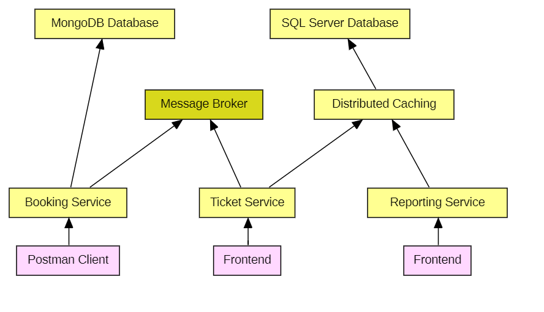

# Containerized CQRS Microservices
Demonstrating microservices implementation with Docker containers

## System Design Steps
1.	User Roles 
2.	User Stories 
3.	Tech Process Flow 
4.	Component Architecture 
5.	Work Dependency Path 
6.	Generic Interfaces and Base Classes

## Base Project Setup
- Docker Ready
- API first
- Interface first
- Domain Classes first
- Mocking first

## Services

# TODO: